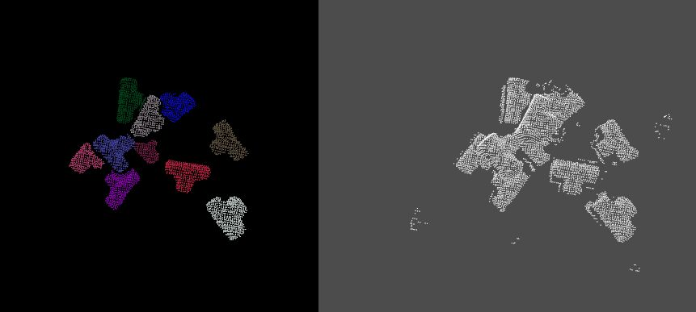
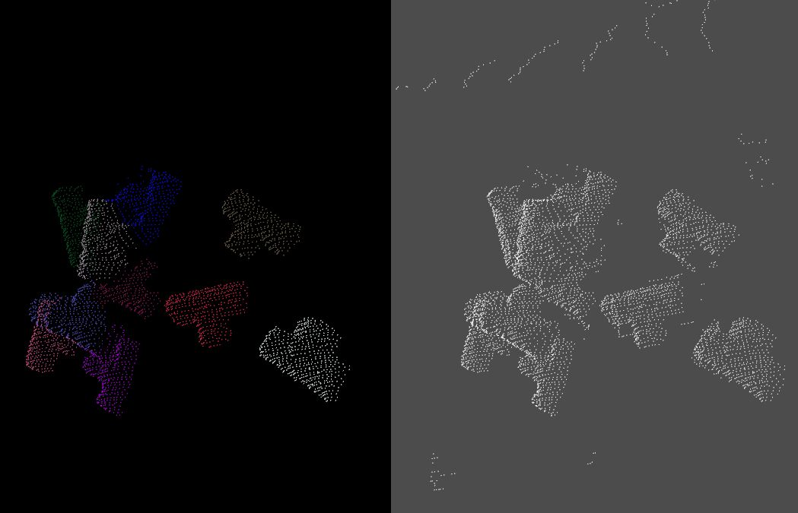
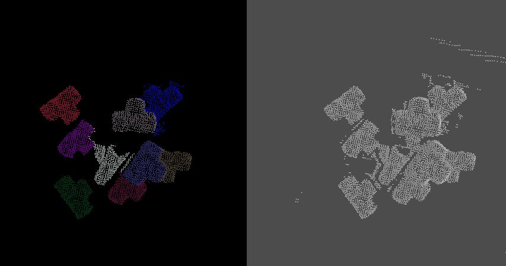

# DBSCAN for PCL

- DBSCAN 是一种基于密度的聚类算法，通过邻域参数（Distance, MinPts）来刻画样本的紧密程度。
## 创新点
- 本程序的DBSCAN算法可应用于PCL，通过kdtree或octotree实现搜索近邻点。
- 本算法在传统DBSCAN的基础上，加入对于边缘点的处理，防止边缘信息的丢失。
- 防止两个物体的点云粘连，在点云合并的部分加入最大点数限制。
- 为配准准确，去除点数过小的点云簇。
---
## 传统DBSCAN效果：

## 加入边缘点处理：

